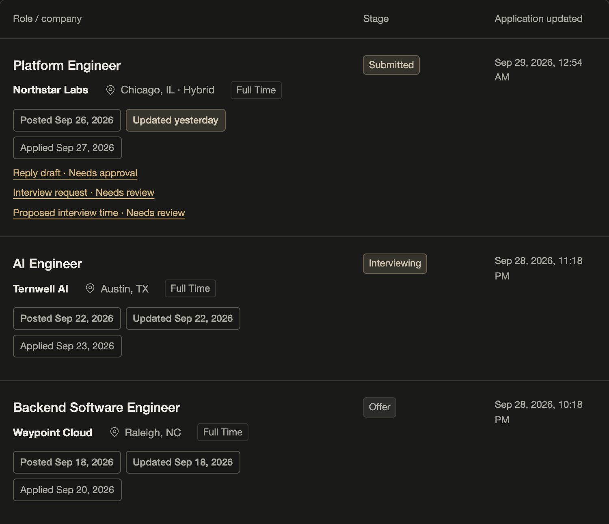
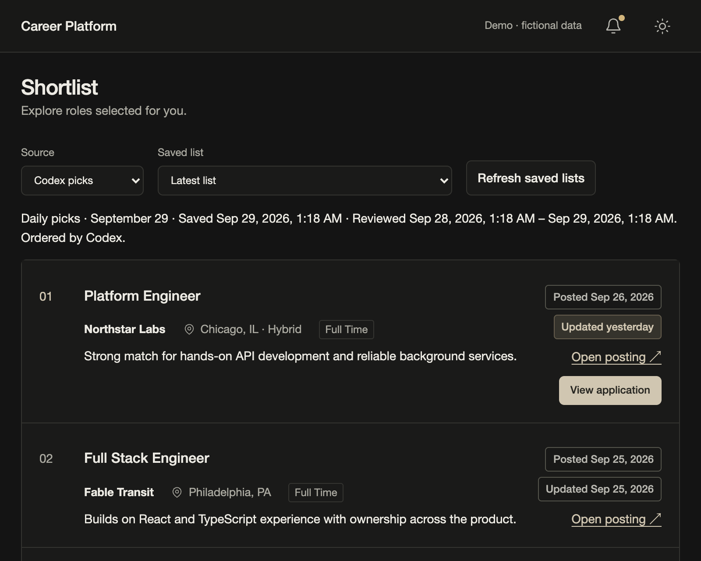
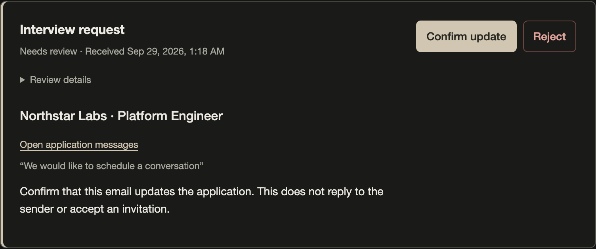
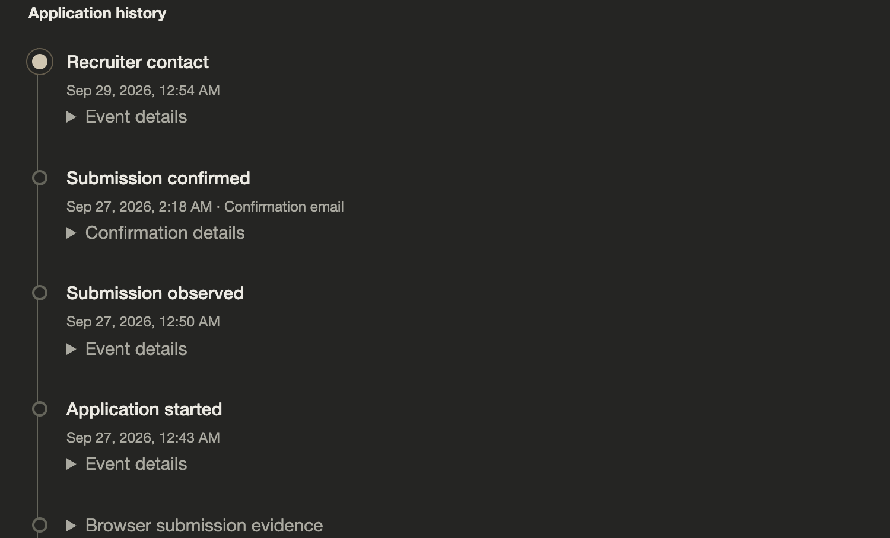

# Career Platform

A personal job-search system that finds relevant roles and keeps each application connected to its submission evidence, recruiter conversations, documents, and next steps.

I built it to preserve the context that usually ends up scattered across job boards, browser tabs, and email. The dashboard and Hermes use shared application services, so the agent can prepare a reply from the same records I inspect in the interface.



[Watch the 30-second overview](docs/media/walkthrough.mp4) · [Run the interactive demo](docs/demo.md) · [System design](docs/system.md)

The film moves through discovery, a job preview, application records, recruiter-message review, and a proposed reply.

It uses the working dashboard, ledger, workers, and MCP server with sample records and simulated providers. No employer is contacted.

## Discovery, tracking, and follow-up

**Shortlist.** Model picks use personal ranking policies over postings collected from Ashby, Greenhouse, and Lever. Codex picks preserve lists selected by a calling agent, including its ordering and explanations. Saved-list history, posting dates, and a shared description preview make it possible to inspect roles without creating application records.



**Applications.** The browser extension matches supported job URLs to the catalog and records submission evidence. Attempts, website acknowledgments, and confirmation emails remain distinguishable. Overview, Messages, and Documents bring the history together; Documents resolves the resume recorded at submission. Employer-side posting changes have their own history.

**Review.** Uncertain email associations and proposed updates remain visible for a decision. Hermes retrieves application context through MCP and can propose recruiter replies and interview times. Approval binds to the exact proposed content, and a worker creates an Outlook draft or private tentative hold. Email sending and employer application submission remain manual.



**Settings and operations.** Connections, career facts, saved resumes, and earlier application drafts live in Settings. Operations exposes collection freshness, background work, and recovery needs. Core and model workers use separate lanes; ranking saves batch progress so interruptions do not discard completed work.



## Try the isolated demo

Requires [uv](https://docs.astral.sh/uv/). The first invocation installs demo dependencies. The running scenario needs no external accounts, model keys, or AWS resources.

```bash
uv run scripts/offline_system_demo.py --interactive --scenario portfolio --state-dir .cache/portfolio-demo --port 8775
```

Open `http://127.0.0.1:8775/#shortlist`. The populated scenario includes 24 postings across three platforms, three saved shortlists, and applications at several lifecycle stages. Browse the preview, records, messages, documents, Review, and Settings. Sean's first name appears with sample contact details and experience.

[Demo instructions](docs/demo.md) cover the scenario transitions, repeated runs, and recording. Use a new empty state directory for each run. The default acceptance scenario remains available without `--scenario portfolio`.

For ongoing development, `uv run scripts/dev-dashboard.py` starts a fresh local
preview with sample data. See [developing alongside the live app](docs/development.md)
for separate development state and preparing updates before choosing when to deploy.

The fixtures demonstrate application behavior, not trained-model quality or a live Outlook/Telegram connection. Agent proposals use fixed responses through the real MCP boundary.

## Engineering decisions

| Area | Implementation and reason |
| --- | --- |
| Personal ranking | Two search policies trained from 2,000 LLM-labeled roles. Semantic features with logistic regression support selective search; word and character TF–IDF features support broad search. Grouped evaluation separates related postings. |
| Shared application history | An append-only SQLite ledger records transitions. Dashboard, extension, CLI, and MCP use common service boundaries and idempotent commands. |
| Agent context | Hermes accesses bounded tools for application history, submitted resumes, and sanitized archived mail. Proposed actions require separate approval. |
| Career information and documents | A structured career profile and saved resumes live in Settings. Application records resolve the document recorded at submission. LaTeX generation remains available through the underlying resume tools; the portfolio demo uses sample PDFs. |
| Background work | Core and model workers have separate lanes, durable work records, leases, heartbeats, retries, and explicit handling of uncertain external outcomes. |
| Deployment | Terraform provisions a single AWS host. Docker Compose runs the services; encrypted storage, backups, and GitHub Actions/SSM support operation and releases. SQLite coordination remains local to that host. |

The labeler and rankers are implemented here; trained personal models and their datasets are not distributed. Agreement with LLM labels is not a measurement of interview success.

## Code and verification

### Repository map

| Location | Contents |
| --- | --- |
| `job_search/` | Application services, workers, MCP, Outlook, career database, and resume tools |
| `job_search/web/` | Dashboard HTML, CSS, and JavaScript |
| `job_search/collection/` | Job-board collection, deduplication, and location normalization |
| `job_search/ranking/` | Personal ranking models, LLM labeling, and the labeling interface |
| `job_search/salary/` | Salary extraction, training, and review interfaces |
| `extension/` | Automatic application detection, submission evidence, optional autofill, and browser tests |
| `tests/` | Offline Python suites, dashboard browser checks, and fictional fixtures |
| `scripts/` | Test runner, isolated demo, dashboard recording, release packaging, and maintenance commands |
| `examples/` | Safe configuration templates |
| `requirements/` | Optional Python dependency groups and the pinned cloud runtime |
| `infra/` and `deploy/` | Terraform and service deployment assets |
| `docs/` | [Documentation index](docs/README.md), runbooks, model notes, and demo media |

Python code lives in `job_search/`; run its commands as modules from the repository root:

```bash
uv run python -m job_search --help
uv run python -m job_search.collection.boards --help
uv run python -m job_search.ranking.model --help
uv run python -m job_search.salary.llm --help
```

The labeling interfaces live beside their services in `job_search/ranking/web/` and `job_search/salary/web/`. Maintenance utilities live in `scripts/`. Dockerfiles and Compose files stay at the root. Runtime databases, credentials, model weights, and generated reports belong in ignored private state directories.

[Command reference](docs/commands.md) covers the entry points and changes from the previous root scripts.

See the [testing guide](tests/README.md) for individual suites and browser setup.

```bash
uv run python -m tests.test_job_boards
uv run --with cryptography --with pypdf --with reportlab python scripts/check-system.py
npm ci --prefix extension
npx --prefix extension playwright-core install chromium
node tests/browser/test_console_browser.mjs
```

The console test exercises the real local application flow, approval boundaries, navigation races, and responsive layouts. Its external services are fixtures. Media capture runs separately through [`scripts/record_dashboard.mjs`](scripts/record_dashboard.mjs), so test reloads and theme checks do not appear in the walkthrough. The [capture guide](docs/demo.md#record-the-overview) covers the lossless screenshots and video output.

- [System design and service boundaries](docs/system.md)
- [Collection, training, and ranking guide](docs/collector-guide.md)
- [Runtime configuration](docs/operations/job-search-runtime.md) and [operations readiness](docs/operations/operations-readiness.md)
- [AWS deployment](docs/operations/aws-deployment.md) and [Compose acceptance](docs/compose-acceptance.md)
- [Career and resume tools](docs/resumes/career-resume-runbook.md)

## Attribution

The collector originated in Matt Herzog's [job-boards](https://github.com/mherzog4/job-boards). Sean Katauskas developed the personal ranking, application platform, agent integration, dashboard, and deployment work described here. The original MIT attribution is retained in [LICENSE](LICENSE).

## Use with your own data

Start with [local-first setup](docs/operations/local-first-setup.md). It keeps personal data outside Git, starts recurring work paused, and supports using an existing resume without model generation. Outlook and Hermes are separate enrollment steps.

## Public source snapshots

This repository receives a daily source snapshot when there are changes, scheduled for 10 PM America/Chicago. Its history starts with one initial release. Offline checks run here; deployment and publishing workflows are included only as inactive setup examples.
