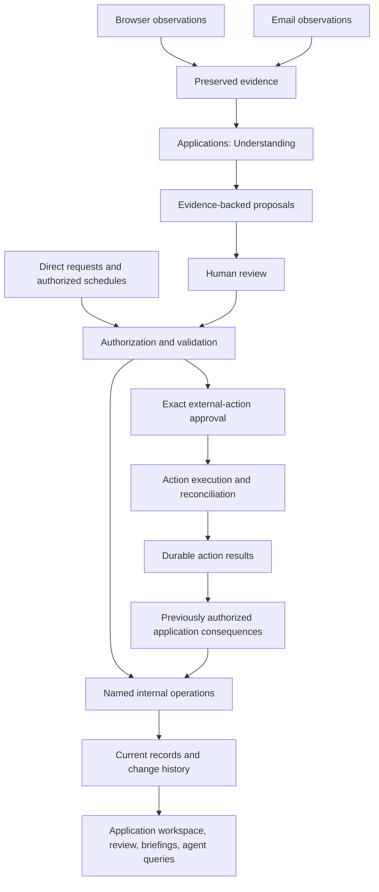

# Application lifecycle and correspondence redesign

Status: the owner system is active in production following the 2026-10-10 UTC
cutover. Start with the [production cutover record and recovery guide](08-production-readiness.md)
for release evidence, remaining verification limits, and recovery requirements.
The original [implementation evidence](implementation-status.md) and [local
walkthrough guide](07-candidate-guide.md) record the earlier isolated test phase.
Prepared from the design conversation on 2026-10-09.

For current email-processing issues and their recovery controls, see
[Email processing and recovery](09-processing-recovery.md).

## Purpose

Make a lifecycle behavior understandable and changeable through one named workflow
and its owning modules. A fix to interview rescheduling should not require finding
independent scheduling rules in mail processing, dashboard handlers, action workers,
and repositories.

An **application is our state and activity for a job**, created when we first add
our own state or take an action on that job. Submission is one event in its life.
Collecting a posting or displaying it does not create an application.

The system preserves external observations, interprets them into proposed
operations, obtains the required authority, and invokes the operation's owner.
Humans, agents, and scheduled code can also request operations directly.

Recording an observation or execution receipt is automatic bookkeeping. Turning
it into a new belief about an application requires review. Deterministically
finishing a consequence already included in an authorized operation is execution
of that instruction, not a new inference. The permission rules are in
[Understanding and review](03-understanding-and-review.md).

## Read and implement in this order

| Document | Use it for |
| --- | --- |
| [Domain and state](01-domain-and-state.md) | Definitions, identity, authoritative records, transitions, and history |
| [Modules and contracts](02-modules-and-contracts.md) | Where behavior lives, public interfaces, transactions, queries, and dependency rules |
| [Understanding and review](03-understanding-and-review.md) | Analysis, evidence references, permissions, proposal review, and replay |
| [Workflows and external actions](04-workflows-and-external-actions.md) | End-to-end behavior, exact approvals, recovery, correction, and combination |
| [Implementation and verification](05-implementation-and-verification.md) | Ordered slices, current source map, migration preparation, and acceptance tests |
| [Agent execution](06-agent-execution.md) | Ownership assignments and integration gates |
| [Candidate guide](07-candidate-guide.md) | Running the isolated system and locating implementation modules |
| [Implementation evidence](implementation-status.md) | Earlier isolated implementation results |
| [Production readiness](08-production-readiness.md) | Production integration, current-data rehearsal, and release gates |

Read this overview and the relevant owner/workflow sections before changing code.
The operation catalog in the contracts document is the entry point for finding a
behavior. The implementation document identifies current sources; the [candidate guide](07-candidate-guide.md) maps those contracts to implemented modules.

## Decisions established with the user

1. Application creation starts with the first added state or action for a job.
2. Browser observations and email are external evidence. Direct requests and
   scheduled triggers are also inputs.
3. Internal updates and external effects are distinct operations with distinct
   owners. An action owns provider behavior and execution state; application code
   owns what the result means for the lifecycle.
4. **All evidence-derived application changes require review initially.** This
   includes confident rules, browser acknowledgments, suggested tasks, and model
   findings. Confidence never substitutes for permission.
5. **External career effects require exact-action authorization.** Accepting an
   application update does not authorize sending or changing a calendar.
6. Different posting identities remain separate until a reviewed combination.
7. Understanding belongs inside Applications. Consumers share its findings rather
   than independently interpreting the same correspondence.
8. Current domain records are authoritative; immutable history explains changes.
   Pending proposals and derived views are not competing accepted state.
9. The new owners take precedence over legacy behavior at every entrypoint.
   Preserve historical evidence and unrelated capabilities, not old lifecycle rules.
   Every email within the configured folders and watermark reaches Understanding;
   relevance is decided there, without a legacy recruiting or verification filter.
10. Substantial redesign is acceptable. PR #39 is a source of reusable work, not
   an accepted design or required starting branch.

## Engineering defaults selected for this blueprint

- Keep one modular Python application and local SQLite coordination. Do not add
  microservices, a message broker, or a configurable workflow engine.
- Use three business owners: Applications, Correspondence, and External Actions.
  Applications contains focused internals for submissions, tasks, interviews,
  assessments, offers, Understanding, and connecting workflows.
- Share transaction, authorization, idempotency, and durable-work mechanics.
  Domain owners retain validation and behavior.
- Use current records plus append-only revisions and decisions. Preserve the old
  event ledger as historical evidence during transition; it must not remain a
  second active state writer.
- Group review by source or workflow, with explicit decisions per operation.
  Internal operations selected together commit atomically; external approvals
  remain separate exact reviews.
- Preserve existing dashboard, extension, CLI, and MCP transports through adapters.
  This redesign does not require adopting #39's HTTP or frontend stack changes.
- Preserve unrelated collection, ranking, shortlist, profile, and document
  capabilities. Feature retirement requires its own product decision.

These defaults are specified in the detailed documents so implementation can
proceed without inventing ownership, permission, or failure rules. Revise the
documents before implementing a materially different behavior.

## Relationship to existing work

Source inspection baseline: `7a6fd17c0746f01f316cc0053dc932ef1dbfefb9`, plus
uncommitted work present in the user's checkout. Those local changes are not
implicitly accepted, discarded, or replaced by this blueprint.

[PR #39](https://github.com/seankatauskas/career-platform/pull/39), inspected at
`2074cc4dfbe695c294ba5a289372ebb45d2abb90`, provides useful transaction ownership,
idempotency, evidence preservation, and transport separation. Retain those ideas
and proven behavior; replace its remaining broad lifecycle mixins, cross-owner
writes, duplicate scheduling authorities, and event-type-driven task inference.

The earlier [shared email-understanding proposal](../mail-understanding-design.md)
contains valuable examples and evidence-validation requirements. For this redesign,
this package supersedes its automatic acceptance gates, incremental compatibility
constraints, and assumed persistence ownership. Do not interpret its "accepted"
label as permission to enable inferred updates automatically.

Existing [system documentation](../system.md) describes the current implementation
and may lag current source. This package describes the replacement. Historical
documentation and migration files are not rewritten to make them appear to have
always followed the new model.

## Completion and authorization boundary

The design documents describe the contracts. The implementation evidence records
which offline checks were run against the isolated candidate.

Success means a routine behavior change can be made in its owner and tested
through its public operation; cross-owner workflows are explicit and few. A larger
file count or passing UI alone does not demonstrate that result.

The user subsequently authorized implementation, merge, deployment, and production
cutover, and declined a separate live integration testing phase. Required release
checks, a fresh consistent backup, conversion validation, and installation binding
remain part of that cutover. Authorization to activate the installation does not
authorize particular career emails or calendar changes; those still require exact
action approval.
