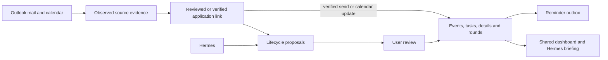

# Hermes application lifecycle

The shared lifecycle service now tracks Outlook evidence, next steps, interviews,
assessments, offers and reviewed corrections through application closure. Hermes,
the dashboard and workers use `JobSearchLedger.lifecycle`; durable state lives in
the existing SQLite ledger, independent of agent conversation memory.

This implements the build sequence from the [baseline investigation](hermes-outlook-lifecycle-investigation.md).
That document describes revision `4820b58`, before these changes.

## What the user can do

- Open an application to see its evidence-backed stage, responsible party, tasks,
  due dates, interview rounds, pending reviews, reminders and mail coverage.
- Create, complete, cancel or snooze tasks. Task completion is separate from
  notification publication. Review task and assessment/offer revision history.
- Read linked inbound/outbound mail in Messages, load older observations, and
  explicitly resolve unknown direction. Only observed sending can complete a
  corresponding draft/reply obligation; creating a draft cannot.
- Configure an optional follow-up after the last observed sent reply. A newer
  incoming response cancels the wait. Silence never becomes a rejection.
- Propose interview times, reschedules, completion or cancellation and confirm them
  in Review. Approval rechecks available calendar data; missing access is reported
  as `not_checked`. Calendar conflicts remain reviewable. A passed end time does
  not prove attendance. Existing accepted schedules can be imported into rounds.
- Review unfamiliar recruiting mail, link it to an existing application, or create
  an external opportunity with real employer/title and no invented URL or submission.
- Record assessment submissions and versioned offer terms/outcomes. Offer acceptance,
  decline, expiry and employer withdrawal retain distinct detail outcomes. The
  existing coarse ledger outcomes remain accepted/withdrawn/rejected respectively.
  Existing detail updates require the revision the user reviewed.
- Start an explicit, bounded historical review from Messages. The requested window
  is at most 366 days and snapshots already staged messages. Status, failure, retry
  and cancel controls preserve the checkpoint. Completion means that snapshot was
  visited, including ignored messages; it does not mean the entire mailbox is known.

## Hermes and HTTP contracts

Hermes reads `get_application_briefing`, `list_application_conversation`,
`list_application_tasks`, `list_application_details`, `get_application_record_history`,
`list_interview_rounds`, `list_application_reminders` and `list_lifecycle_reviews`.
`search_mail_history` returns bounded scan coverage and a continuation, even when
an individual archive page contains no matches. Tasks/details accept offsets;
conversation and record history return continuations. Reviews and reminders accept offsets too.
Hermes trims whole rows before calculating continuations, retains archive scan cursors
without dropping matches, and flags clipped content. Coverage survives large briefings. Briefings are bounded summaries
with limits and truncation indicators. Safe evidence references survive tool filtering;
raw transport IDs, secrets and archive paths do not.

`propose_application_update` supports task/detail proposals, stage correction,
reopening, wrong association, duplicate records and superseded facts.
`propose_interview_revision` proposes immutable round changes. Hermes cannot approve
these proposals or directly change tasks/offer outcomes. Existing exact-content
approval for Outlook drafts/private holds is retained, and neither tool sends mail.

Authenticated dashboard reads include:

- `GET /api/v1/applications/{id}/briefing`
- `GET /api/v1/applications/{id}/conversation?limit=25&cursor=...`
- `GET /api/v1/applications/{id}/conversation/{observation_id}` for a linked sanitized excerpt
- `GET /api/v1/lifecycle/history/{task|detail}/{id}?after_revision=0&limit=25`
- `GET /api/v1/lifecycle/reviews` and `/api/v1/lifecycle/replays`

User commands are explicitly whitelisted under `POST /api/v1/lifecycle/` and use
existing session authentication, CSRF protection and idempotency. Direct detail
updates supply `values.expected_revision_no`; stale approvals fail without changing
state. Proposed corrections compare their original application/task/detail state.
Association repair of an applied event requires an explicit corrected source phase.
Interview proposals compare both current revision and round status, so closing and
reopening an application cannot revive an old proposal.



## Evidence, calendar and worker behavior

### Mail arriving before application capture

During maintenance, Outlook polling and the browser extension's queued submissions
can resume in either order. Mail classification now checks application identity
independently of model confidence. A shared ATS sender, matching role title, or
recent submission alone cannot select an employer. Explicit employer and role
wording in supported recruiting phrases must agree with the candidate; a conflicting
employer overrides a previously linked conversation. Same-company roles without a
unique role, posting ID, or reviewed thread remain unassigned. Incomplete candidate
context also leaves the proposed application unset.

Unassigned event proposals remain in Review after the message is processed. Review
refreshes derive current supported choices from retained evidence and local application
history, so a delayed browser submission becomes selectable without another Outlook
request or model call. The user must choose an application; the first candidate is
never selected by default. Acceptance rechecks the current choices and preserves the
email's original receipt time. Unsupported temporal analysis and automatic thread
linking are withheld. Corrected mail links take precedence over historical approvals
when retrieving future thread matches.

Employer/role phrase recognition is intentionally conservative; it is not a general
company-alias resolver. Unresolved messages remain reviewable. This change does not
add phone notifications for pending mail reviews or change the polling/deployment
schedule. Coverage is in `tests/test_mail_identity.py` and the Review browser suite.

Mail direction is derived from actual Inbox/Sent folder identities, explicit draft
status, or a reviewed decision. Unknown custom-folder direction remains unknown.
Drafts are gated before either classifier. Outgoing candidate text cannot become an
incoming employer outcome. Source timestamps remain distinct from ingestion/review
times; delayed review uses the original evidence time.

Mail association is independent of phase-setting events. Strong thread linkage can
retain routine replies. Exact account/message correlation proves observed draft
sending and closes only the matching obligation. Evidence links, revisions and
review decisions remain auditable.

Interview rounds retain immutable revisions, invite identity, organizer and source
modification time. Calendar change keys are opaque. The worker discovers candidate
matches within a bounded window for review, then follows approved event identities
directly, including events moved outside that window. Private holds cannot masquerade
as employer confirmation; missing events do not imply cancellation. Reschedules
cancel obsolete tasks/reminders and queued delivery atomically.

`outlook.calendar.sync` and `outlook.mail.replay` run with the existing Outlook mail
activation group at five-minute intervals. Replay workers filter by configured
account and heartbeat between messages. Transient failures/lease loss retain the
checkpoint; permanent failures expose a safe error and require explicit retry.
Cancelling a replay prevents further checkpoint advancement. Normal mail activation
cutoffs are not widened. Historical replay is review-only and suppresses temporal
notification creation. Explicitly accepting old deadlines records them without
publishing stale alerts; an explicit snooze can make a current reminder actionable.

The existing reminder tick publishes task and interview notifications through the
outbox. Terminal closure, task resolution, rescheduling and cancellation invalidate
obsolete queued deliveries, including already claimed leases. Notification publication
does not prove delivery or completion of the underlying work.

## Structure, migration and verification

`job_search/lifecycle/` is the ledger persistence boundary: `core.py`, `mail.py` and
`interviews.py` implement domain rules, `briefing.py` composes reads, and `tools.py`
and `dashboard.py` define narrow transport contracts. Runtime adapters schedule the
existing service. Transports do not open SQLite or accept caller-selected actors.

Migration 15 composes additive schema fragments in one transaction. Fragments were
finalized together before release; never edit this migration after deployment.
Deploy through the existing release workflow with its normal backup. Rollback needs
a compatible backup. This work has not deployed or migrated production.

Offline domain tests cover draft/send identity, pagination, source dates, replay
checkpoint recovery, account isolation, authority, stale decisions, evidence association,
calendar ordering, conflicts, terminal cleanup and queued notification cancellation.
`tests/test_lifecycle_output.py` verifies long UTF-8 pages retain every row and usable
continuations under the output limit. `tests/test_lifecycle_integration.py` exercises real authenticated HTTP and Hermes
against the same service. `tests/browser/test_lifecycle_browser.mjs` exercises task
history, assessment versions, interview review and mobile layout. The system runner
includes these checks; pre-commit includes lifecycle suites.

Run the complete check with:

```sh
uv run --with cryptography --with pypdf --with reportlab python scripts/check-system.py --browser --output .cache/lifecycle-final.json
uv run python -m tests.test_job_boards
```

Validation on 2026-10-03: **107/107 system suites passed**, including all eight
browser suites; the collector baseline and final checks both passed all 80 tests.
The local receipt is `.cache/lifecycle-final.json`; lifecycle screenshots and browser
results are under `.cache/lifecycle-browser/`.

The authority regression was also fault-injected by temporarily replacing the
user guard in-process: the test failed with the guard removed and passed unchanged.
No source alteration was retained. All acceptance uses fictional evidence and local
fixtures; live Graph/provider behavior and production rollout remain unverified.

Graph contracts were checked against Microsoft's [message resource](https://learn.microsoft.com/en-us/graph/api/resources/message?view=graph-rest-1.0),
[immutable IDs](https://learn.microsoft.com/en-us/graph/outlook-immutable-id),
[event resource](https://learn.microsoft.com/en-us/graph/api/resources/event?view=graph-rest-1.0),
and [calendarView](https://learn.microsoft.com/en-us/graph/api/user-list-calendarview?view=graph-rest-1.0).

## Coverage limits and deferred scope

Coverage reports observed/linked messages, connector success and processing cutoffs
separately. A completed page or replay is never proof that missing mail does not
exist. Calendar discovery is bounded; unknown invitation identity requires review.
Phone calls, portal-only events and unobserved sends need explicit user records.

Post-acceptance onboarding/start-date tracking remains outside this application
lifecycle, as scoped in the investigation. Automatic sending and attendance inference
are also outside this implementation. No new AWS resources are required.
