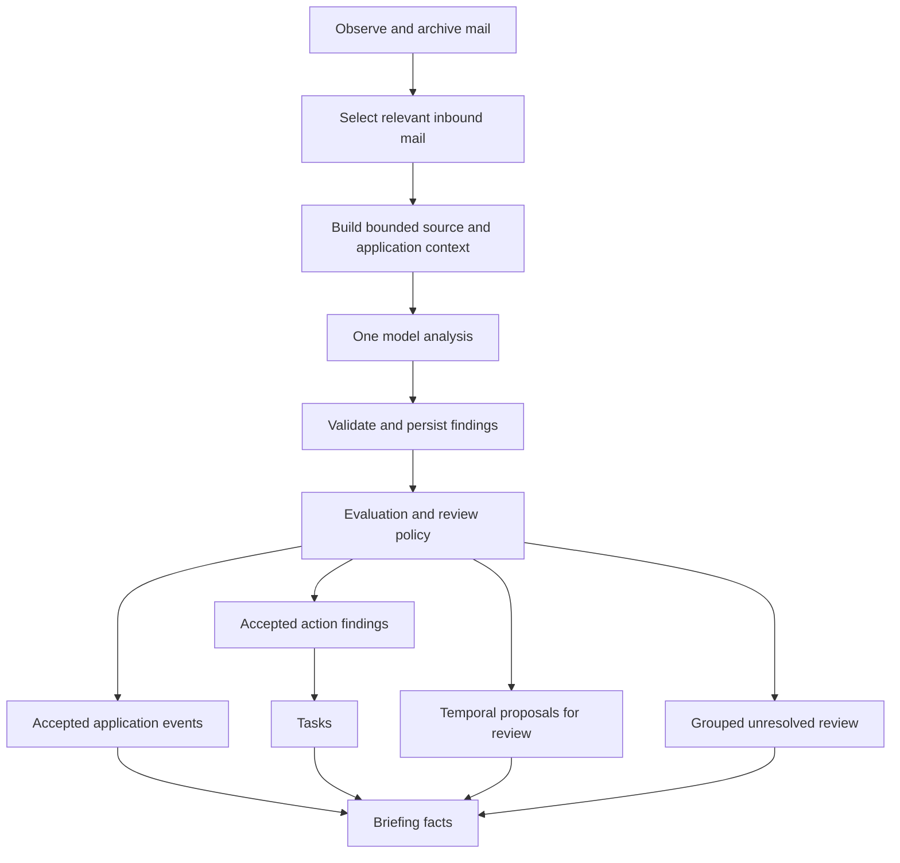

# Shared email understanding for career briefings

Status: implemented in the shared-mail worktree with an explicit rollout mode;
production activation is separate. See [operations](operations/shared-mail-understanding.md).
Legacy processing remains the default for existing installations; the briefing
cleanup is preserved.

## Decision

Use one model analysis of each relevant incoming message to identify application
events, requested actions, and scheduling facts together. Persist the validated
analysis and let status updates, tasks, reviews, and briefings consume it. A receipt
template must not bypass that analysis. Downstream consumers must not independently
decide what the same email means using question marks or request-word patterns.

For example, “Thank you for applying. Please complete the assessment by Friday”
contains both a receipt and an assessment request. A receipt match cannot discard
the request, and an assessment request does not automatically mean an email reply
is required. Conversely, “What happens next?” in a receipt explains the employer's
process and does not establish an applicant obligation.

The model interprets meaning. Deterministic services validate evidence, enforce
identity and lifecycle constraints, deduplicate findings, and control mutations.
An exact quote proves that wording exists; it does not prove that the model's
interpretation is correct. Evaluation and review remain necessary.

## Current implementation and replacement boundaries

| Current responsibility | Current source | Target |
| --- | --- | --- |
| Receipt template bypasses the classifier | `job_search/mail/pipeline.py`, `rules.py` | Every eligible message reaches the shared analyzer; templates can supply hints only |
| One event per model output, with an empty payload | `job_search/mail/proposals.py`, `model.py`, `remote.py` | A versioned analysis containing multiple independent findings |
| Body and attachments receive separate temporal model calls | `job_search/mail/secure_ingest.py`, `temporal.py` | Include bounded source material in the shared analysis; reuse temporal validation and review |
| Reply obligations are inferred again from message wording | `job_search/career_actions/service.py`, `reply_requests.py` | Project accepted action findings; remove the independent detector at cutover |
| Some accepted events automatically imply a task | `job_search/lifecycle/core.py:ensure_event_task` | For shared-analysis mail, create tasks from action findings only |
| Briefings combine event, task, review, and mail facts | `job_search/attention/portfolio.py` | Consume projections with common analysis and finding references |

Keep the existing event ledger, exact send approvals, and calendar review contracts.
Do not smuggle action data into the current empty event payload. Add a separate
versioned analysis contract and persistence through the service boundary. Existing
non-mail event producers keep their task behavior unless explicitly migrated.

## Input and coverage

Preserve deterministic handling of drafts, direction, source identity, duplicate
delivery, and ignored folders. Outbound mail reconciles sent actions; it does not
create new incoming requests. Candidate retrieval includes previously linked
threads and known application correspondence, so a reply such as “Tuesday works”
does not need a recruiting keyword. Relevance filtering favors recall and records
why mail was excluded; it must not become a hidden receipt-classification bypass.

Supply the current sanitized message, a bounded recent thread, candidate application
identities and phases, source timestamps, and explicit coverage metadata. Label
each source as current authored text, quoted history, prior inbound, prior outbound,
or attachment. Old requests provide context; they cannot independently create a
new task. A new message may explicitly renew an old request, in which case both
the renewal and its referenced request must be cited.

Retain the existing maximum of 20 application candidates. An incomplete candidate
set or unsupported employer match prevents automatic application assignment. The
model may return an unassigned finding for review rather than choosing the most
recent application. A previously linked conversation does not override an explicit
employer conflict.

The current 2,048-character evidence excerpt is insufficient as the sole source for
long mixed messages. Build the new input from sanitized archived sources within the
configured inference budget. Keep immutable source IDs, hashes, and source-relative
offsets, so each quote is verifiable against exactly what the model received.
Bound attachment extraction and thread history before inference. Account for the
larger output schema in token budgeting; do not simply reuse the current 1,024-token
classification allowance.

Prefer the current authored body over historical context when trimming. Report
omitted or truncated sources explicitly. A missing attachment, truncated current
body, or unresolved referenced message cannot be interpreted as “no action needed.”
Incomplete coverage remains visible and prevents automatic dismissal of the message.
Authorized archive excerpts stay private under existing mail access controls; logs
and usage records retain identifiers and counts rather than bodies.

## Analysis contract

Use a strict schema with no additional fields. IDs, hashes, producer version, input
coverage, and processing times are supplied by the service, not invented by the
model. The model returns these semantic fields:

| Field | Meaning |
| --- | --- |
| `relevance` | `career`, `not_career`, or `uncertain`; no forced event classification |
| `events[]` | Zero or more supported existing mail event types, each with application selection, confidence, and evidence references |
| `actions[]` | Zero or more applicant requests, each with kind, requested outcome, application selection, confidence, evidence references, and optional temporal reference |
| `temporal_facts[]` | Explicit interview intervals or deadlines with source wording, normalized values when supported, time zone, evidence, and confidence |
| `uncertainties[]` | Bounded reasons such as ambiguous identity, missing time zone, conflicting requests, or unclear addressee, linked to affected findings |

Each finding has a stable service-assigned reference. Evidence consists of source ID,
exact quote, and start/end offsets. Set explicit limits on arrays, quote lengths,
and free-text fields; use the existing 512-character quote bound. Validate every
reference, enumeration, field type, confidence range, and source span before any
projection. Invalid output is a failed analysis attempt, not an empty successful
analysis. The limits and JSON schema are frozen in
[the implementation contract](mail-understanding-implementation.md) and covered by
offline contract fixtures.

Action kinds initially map to existing tasks: `reply`, `send_availability`,
`complete_assessment`, and `offer_decision`. Other clear requests remain typed
`other` findings for review until a task mapping is defined; do not disguise them
as generic follow-ups. Store whether the request is required, optional, or unclear
and who must act. Only an explicit applicant obligation is eligible for an automatic
task. Optional support invitations and rhetorical headings produce no action.

Derive “reply required” from accepted `reply` or `send_availability` findings, rather
than asking the model for a second potentially contradictory boolean. An interview
invitation may ask the user to book through a link; it does not by itself justify a
send-availability task. A no-reply sender does not invalidate a real portal-based
assessment request. Preserve the actual requested action and channel.

Zero events with a real action is valid. A receipt plus an assessment request is
also valid. An invitation is distinct from a confirmed appointment. Contradictory
findings remain unresolved rather than allowing list order to pick the final state.

Temporal facts retain their original wording even when normalization is incomplete.
“By Friday” with insufficient time-zone or cutoff information creates no invented
UTC deadline or midnight alarm. The action can still appear with “deadline needs
clarification.” Fully supported values pass the existing temporal interval, horizon,
time-zone, and human-review gates before changing task due dates or calendar state.

## Persistence, review, and task projection

Add immutable analysis, finding, and projection records in a new checksummed
migration. Record the account/message identity, source and context fingerprints,
schema/prompt/model versions, policy version, coverage, and finding references.
Persist a validated analysis before downstream work. A retry after a task or event
write fails resumes projection from that analysis without another semantic call.

Use a durable processing claim so concurrent workers cannot analyze/project the
same input simultaneously. An inference timeout may require a bounded retry; “one
analysis” is not a promise of exactly one provider request under transport failure.
Provider usage remains metered through the existing inference budget and provenance
system. Model unavailability or exhausted budget leaves work pending with a coverage
notice; it never falls back to speculative keyword-created tasks.

Review decisions are append-only and independent for each finding. Accepting a
receipt or application link does not approve a reply request in the same message.
Group related findings into one review presentation so the user can accept, correct,
or reject them together without losing those separate decisions. Rejected and
cancelled findings stay suppressed during retries and later model-version replays.

Automatic status acceptance continues to use the version-matched, per-class locked
evaluation gate in `mail/policy.py`; model self-confidence alone is insufficient.
Add separately evaluated action-kind gates before enabling automatic task creation.
Until those pass, actionable findings stay in review and appear once in the briefing.
Terminal outcomes and temporal facts retain their current review requirements.

Task creation checks accepted identity, active application, current conversation
state, and prior task history under the existing mutation lock. Recheck for a newer
inbound or sent message before projecting a stale request. Do not assume every newer
message resolves every earlier action; hold contradictory or superseded findings
for reconciliation. Use the finding reference for projection idempotency and retain
cross-version equivalence/review history so changed quote offsets cannot recreate
a cancelled task. One email may legitimately produce multiple different tasks.

For mail carrying a shared analysis, `ensure_event_task` must not independently
create a second obligation from the event type. The accepted action finding owns
the task. During rollout exactly one task-producing path owns a message; the old
reply detector and the new projector must never both be active for it.

Reply drafting can still use a separate generation call after a task exists. It is
a different operation and must use the accepted request, verified reply context,
and available personal facts. Understanding an email never authorizes sending it.
Sending still requires an exact approved proposal; calendar writes still use the
existing trusted confirmation and approval policies.

## Briefing behavior

Build briefing facts from accepted events and actions, pending reviews, and coverage.
The briefing model can summarize these facts, but cannot reclassify an email or
invent a task. Shared analysis/finding references let the renderer represent one
development once rather than repeating an event, mail subject, and task separately.

Keep the current briefing cleanup: **Needs you**, **Review**, meaningful **Employer
update**, and one **Application activity** count for routine submissions and receipts.
If a confirmation contains a request, count the receipt in routine activity and show
the concrete request as an action or review. Do not print a generic “Change” row.
An uncertain message gets one review entry, not a confident interview claim.

## Rollout and verification

1. Freeze the analysis schema and add offline fixtures plus a reviewed evaluation
   set. Version local and remote adapter contracts together; do not silently accept
   old single-event JSON as a complete shared analysis.
2. Implement persistence and validated analysis in shadow mode. Compare with the
   existing pipeline without creating a second set of events, tasks, reviews, or
   notifications. Keep shadow differences in diagnostic views, outside briefings.
3. Implement event/action/temporal projection and grouped review. Verify retry,
   identity, task ownership, and cancellation behavior with temporary databases.
4. Cut over new eligible mail to the shared path, remove the receipt short circuit
   and separate reply detector for that path, and stop independent body-temporal
   model calls. Attachment evidence joins the bounded analysis. Retain deterministic
   attachment parsers and existing temporal validators.
5. Audit all linked archived inbound history through bounded, resumable batches.
   Historical replay is review-only and cannot trigger a notification flood, restore cancelled tasks, or
   rewrite delivered briefings. Correct legacy false tasks with audited transitions.
6. Release using the existing GitHub/Terraform workflow and schema-backup procedure
   in [AWS deployment](operations/aws-deployment.md). A code rollback must respect
   the new schema and ownership marker; it cannot reactivate legacy task creation
   for messages already owned by the shared path.

Required acceptance cases:

| Message or condition | Expected behavior |
| --- | --- |
| Receipt with “What happens next?!” | Receipt only; no reply task or interview claim |
| Receipt with `?organizationId` in a footer link | Receipt only |
| “Contact us if you have questions” or “No response needed” | No required reply |
| Receipt plus mandatory assessment | Receipt and assessment findings; one assessment task after acceptance |
| Assessment plus explicit request to confirm by email | Separate assessment and reply findings with distinct evidence |
| Unfamiliar wording asking for availability | Model can identify the request without a template match |
| Invitation with a booking link | Correct booking request; no fabricated availability reply or confirmed appointment |
| Quoted old request in a new informational message | No new obligation based solely on the quote |
| Explicit renewal of a prior unanswered request | Cite renewal and prior request; reconcile with the existing task |
| Unclear company, conflicting employer, or truncated candidate set | Unassigned or held review; no automatic task |
| Missing attachment or a request beyond the supplied prefix | Coverage warning; no confident no-action dismissal |
| “By Friday” without enough temporal context | Preserve wording; no invented timestamp |
| Invalid JSON, unsupported quote, or prompt injection | Reject invalid output; source content cannot execute instructions |
| Provider timeout, projection retry, or concurrent workers | Bounded inference retries and idempotent projections |
| New model version, cancelled task, or historic replay | Retain prior decisions; no duplicate or resurrected task |
| New outbound reply while analysis is pending | Reconcile current state before task creation |
| Receipt accepted but action rejected | Receipt recorded; no action task |

Measure event and action precision separately, along with missed requests in mixed
messages, wrong-application matches, abstentions, invalid output, review volume,
duplicate tasks, latency, and cost per analyzed message. Keep regression fixtures
separate from a locked evaluation set. The current event gate requires at least 50
high-confidence predictions across at least 50 distinct messages, 99% observed
precision, and no wrong-application
matches per eligible class; changing the contract/model invalidates prior reports.
Define and pass equivalent action gates before automatic task activation. Passing
offline contract tests does not establish semantic model accuracy.
