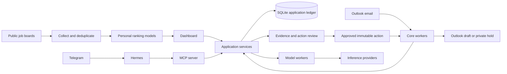

# System design

Career Platform keeps application state in shared services. The dashboard, CLI, browser extension, and Hermes tools are clients of those services.

## The application is the unit of context

An application stores the job snapshot and recommendation provenance. Its append-only events produce the current stage. Submissions bind to the selected resume artifact, preserving what was submitted when the career profile changes later.

The dashboard's application workspace combines the timeline, resume selection, linked mail, proposed updates, and Outlook actions. Message associations come from stored proposals and applied events. It never joins messages to applications by company-name similarity. A locked or unavailable archive leaves the history usable and shows the stored evidence excerpt.

Navigation uses `#applications/{id}/{tab}` for Overview, Messages, and Documents. Proposed updates and Outlook actions live in Review. Career profile, saved resumes, earlier application drafts, and Operations live under Settings. Legacy routes redirect to these views; posting history expands within Overview. Request epochs prevent an older network response from replacing a newer selection.

The read-only `GET /api/v1/applications/{id}/workspace` endpoint composes existing services. `GET /api/v1/shortlist/job?ats=...&id=...` reads a bounded job description only for a role in the browser's current shortlist. Mutations retain their existing service contracts, CSRF checks, idempotency, and exact-payload approval.

## Training the rankers

An LLM teacher labeled 2,000 roles against personal experience and preferences. The selective policy uses semantic features and logistic regression. The broad policy uses word and character TF–IDF features with logistic regression. Related postings are grouped during cross-validation to reduce leakage from duplicate roles and templates.

The training process evaluates alternatives, but the retained runs use the linear baselines. Teacher agreement measures replication of those labels, not verified personal satisfaction or application outcomes. Location and compensation constraints remain explicit parts of shortlist policy. Application feedback is delivered through an outbox to avoid duplicating feedback on retries.

## Agent proposals and execution

Hermes uses MCP tools to retrieve bounded application history, sanitized archived email, and submitted-resume context. The platform retains its state independently of the agent. Hermes does not receive a database connection or Outlook credentials.

A proposed reply stores its exact payload for separate approval. Execution is handled by a worker, and altered content cannot reuse an earlier approval. The connector creates drafts and private tentative holds. Sending messages and accepting invitations are outside its capabilities.

## Operating the system

Core workers handle routine synchronization and actions; model workers handle expensive generation. Durable work records, leases, and heartbeats support recovery. Unknown external outcomes require reconciliation before retrying a write.

Terraform and Docker Compose support a single EC2 deployment, with persistent state on encrypted storage and private dashboard access. GitHub Actions and Systems Manager handle releases. This preserves SQLite's local coordination and keeps the deployment small. A multi-host design would require a different database and shared artifact storage.

The repository includes offline acceptance checks. Those checks establish behavior with controlled inputs; live Outlook authorization, provider availability, AWS backups, and cloud recovery require the deployment's own verification.
